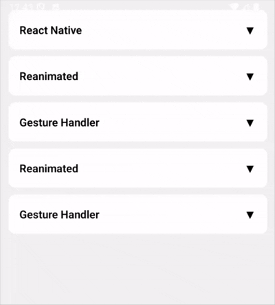

# react-native-smooth-collapse

🚀 A high-performance, smooth, and fully customizable collapsible/accordion component for React Native powered by Reanimated 3.

---

## ✨ Features

* ⚡ Smooth height animations using Reanimated 3
* 🧠 Fully typed with TypeScript
* 🎯 Controlled & imperative API support
* 📦 Lightweight and dependency minimal
* 🔁 Progress tracking (`0 → 1`)
* 🎛 Custom animation duration
* 📉 Supports `collapsedHeight`
* 🧹 Optional `unmountOnCollapse` for performance
* 🧩 Accordion & multi-expand (group support)
* 📱 Works with FlatList / SectionList
* 🔌 External progress sync (SharedValue)
* 🪄 Imperative methods (`expand`, `collapse`, `toggle`)

---

## ✨ Demo

<p align="center">
  
</p>

---

## 📦 Installation

```bash
npm install react-native-smooth-collapse
```

---

## ⚠️ Reanimated Setup (Required)

Make sure your app is configured:

```js
// babel.config.js
module.exports = {
  presets: ['module:metro-react-native-babel-preset'],
  plugins: ['react-native-reanimated/plugin'],
}
```

---

## 🚀 Basic Usage

```tsx
import {
  CollapsibleGroup,
  CollapsibleItem,
  CollapsibleTrigger,
  CollapsiblePanel,
} from 'react-native-smooth-collapse';

<CollapsibleGroup>
  <CollapsibleItem>
    <CollapsibleTrigger>
      <View>
        <Text>React Native</Text>
      </View>
    </CollapsibleTrigger>

    <CollapsiblePanel>
      <View>
        <Text>Build native mobile apps using React.</Text>
      </View>
    </CollapsiblePanel>
  </CollapsibleItem>
</CollapsibleGroup>
```

---

## 🧩 Group (Accordion / Multi Expand)

```tsx
import {
  CollapsibleGroup,
  CollapsibleItem,
  CollapsibleTrigger,
  CollapsiblePanel
} from "react-native-smooth-collapse"

<CollapsibleGroup accordion>
  <CollapsibleItem>
    <CollapsibleTrigger>
      <Text>Header 1</Text>
    </CollapsibleTrigger>
    <CollapsiblePanel>
      <Text>Content 1</Text>
    </CollapsiblePanel>
  </CollapsibleItem>

  <CollapsibleItem>
    <CollapsibleTrigger>
      <Text>Header 2</Text>
    </CollapsibleTrigger>
    <CollapsiblePanel>
      <Text>Content 2</Text>
    </CollapsiblePanel>
  </CollapsibleItem>
</CollapsibleGroup>
```

---

## 🚀 Controlled Usage

```tsx
import React, { useState } from "react"
import { View, Text, TouchableOpacity } from "react-native"
import { Collapsible } from "react-native-smooth-collapse"

export default function App() {
  const [open, setOpen] = useState(false)

  return (
    <View>
      <TouchableOpacity onPress={() => setOpen(!open)}>
        <Text>
          Toggle
        </Text>
      </TouchableOpacity>

      <Collapsible expanded={open}>
        <View>
          <Text>Hello World</Text>
        </View>
      </Collapsible>
    </View>
  )
}
```

---

## 🎛 FlatList Accordion Example

```tsx
import React, { useState } from "react";
import { View, Text, TouchableOpacity, FlatList } from "react-native";
import { GestureHandlerRootView } from "react-native-gesture-handler";
import { Collapsible } from "react-native-smooth-collapse";

const DATA = [
  { id: "1", title: "Item 1", content: "Content 1" },
  { id: "2", title: "Item 2", content: "Content 2" },
];

export default function App() {
  const [openId, setOpenId] = useState<string | null>(null);

  return (
    <GestureHandlerRootView>
      <FlatList
        data={DATA}
        keyExtractor={(item) => item.id}
        renderItem={({ item }) => (
          <Item
            item={item}
            expanded={openId === item.id}
            onPress={() =>
              setOpenId(openId === item.id ? null : item.id)
            }
          />
        )}
      />
    </GestureHandlerRootView>
  );
}

function Item({ item, expanded, onPress }: any) {
  return (
    <View>
      <TouchableOpacity onPress={onPress}>
        <Text>{item.title}</Text>
      </TouchableOpacity>

      <Collapsible expanded={expanded}>
        <Text>{item.content}</Text>
      </Collapsible>
    </View>
  );
}
```

--- 

## 🎚 Using `collapsedHeight`

```tsx
<Collapsible expanded={open} collapsedHeight={50}>
  <Text>Partially visible content</Text>
</Collapsible>
```

---

## 🧹 Unmount on Collapse

```tsx
<Collapsible expanded={open} unmountOnCollapse>
  <HeavyComponent />
</Collapsible>
```

---

## 🔗 Shared Progress (Reanimated)

```tsx
import { useSharedValue } from "react-native-reanimated"

const progress = useSharedValue(0)

<Collapsible expanded={open} progress={progress}>
  <Text>Content</Text>
</Collapsible>
```

---

## 🔁 Multi Expand Mode

```tsx
<CollapsibleGroup accordion={false}>
  {/* multiple items can stay open */}
</CollapsibleGroup>
```

---

## ⚡ Hook Usage (`useCollapsible`)

```tsx
import { useCollapsible } from "react-native-smooth-collapse"

const { style } = useCollapsible(
  expanded,
  200, // contentHeight
  300, // duration
  0    // collapsedHeight
)

<Animated.View style={style}>
  <Text>Content</Text>
</Animated.View>
```

---

## 📚 API

### `Collapsible`

| Prop              | Type                | Default | Description                     |
| ----------------- | ------------------- | ------- | ------------------------------- |
| expanded          | boolean             | false   | Controls expand/collapse        |
| duration          | number              | 300     | Animation duration              |
| collapsedHeight   | number              | 0       | Minimum height                  |
| unmountOnCollapse | boolean             | false   | Unmount children when collapsed |
| progress          | SharedValue<number> | -       | External progress               |
| onAnimationEnd    | () => void          | -       | Callback after animation        |
| onProgress        | (progress) => void  | -       | Progress callback               |
| children          | ReactNode           | -       | Content                         |

---

### `useCollapsible`

| Param           | Type    | Description        |
| --------------- | ------- | ------------------ |
| expanded        | boolean | State              |
| contentHeight   | number  | Measured height    |
| duration        | number  | Animation duration |
| collapsedHeight | number  | Min height         |

---

### `CollapsibleRef`

```ts
expand()
collapse()
toggle()
```

---

### `CollapsibleGroup`

| Prop      | Type    | Default | Description      |
| --------- | ------- | ------- | ---------------- |
| accordion | boolean | false   | Single open item |

---

## 🎬 Demo

👉 Add your GIF here:

```

```

---

## 🧠 Why use this?

* Faster than traditional collapsible libraries
* Reanimated-powered (UI thread animations)
* Clean API + TypeScript support
* Works in large lists without jank

--- 

## ⭐ Support

If you like this package, please consider giving it a star on GitHub!

## 🤝 Contributing

Pull requests, bug reports, and feature suggestions welcome! [Open an issue](https://github.com/antosmamanktr/eact-native-multi-range-slider/issues)

--- 

## 🧑‍💻 Author

**Made with ❤️ by Antos Maman**

- GitHub: [@antosmamanktr](https://github.com/antosmamanktr)
- Email: [antosmamanktr@gmail.com](mailto\:antosmamanktr@gmail.com)

---

## 📄 License

MIT License

--- 
